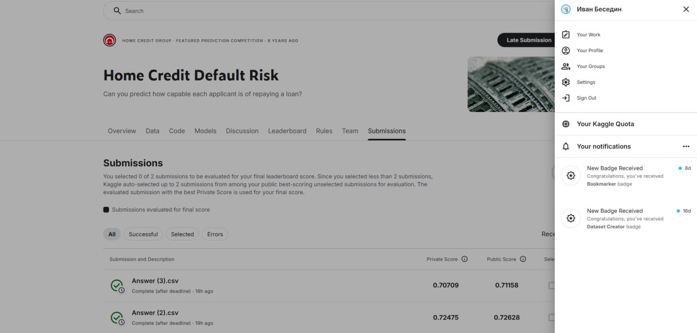

# README: Прогнозирование дефолта по кредиту (Home Credit Default Risk)

## Название соревнования и ссылка
**Соревнование:** [Home Credit Default Risk](https://www.kaggle.com/c/home-credit-default-risk)  
*Описание: предсказание вероятности того, что клиент не сможет погасить кредит.*

## Результат на Kaggle
**Публичный результат (ROC AUC):** 0.7265

**Место в лидерборде:** Даже не 20%

## Краткое описание подхода
Подход заключается в уменьшении размерности, с целью повышения качества обучения. За Baseline был взят `RandomForestClassifier`, дальнейшие улучшения и поиски привели к `StackingClassifier`. И уже на нём велись эксперименты по размерности и обработке данных.
В финальном решении убрана большая часть признаков, т.к они являются малоинформативными, а также лучший результат показал результат без обработки выбросов, вероятно благораря тому, что обладает большей обобщающей способностью.

## Предобработка данных
### 1. Преобразование категориальных признаков в числовые
Категориальные переменные обрабатывались следующими способами:

- **Бинарные признаки** (`CODE_GENDER`, `FLAG_OWN_CAR`, `FLAG_OWN_REALTY`, `EMERGENCYSTATE_MODE`) преобразованы в 0/1.
- **Порядковые признаки**:
  - Уровень образования (`NAME_EDUCATION_TYPE`) закодирован порядковыми значениями от 1 (Lower secondary) до 5 (Academic degree).
- **One‑Hot Encoding** применён к:
  - `NAME_TYPE_SUITE` (после объединения редких категорий в группы `Alone`, `Family`, `Other`);
  - `NAME_FAMILY_STATUS` (удалена категория `Unknown`, если присутствовала);
  - `NAME_INCOME_TYPE`;
  - `OCCUPATION_TYPE` (предварительно объединена в обобщённые группы: `High_income_stable`, `Medium_income`, `Labor_physical`, `Service`, `Security`, `Rare`);
  - `HOUSING_TYPE_GROUP`, `FONDKAPREMONT_GROUP`, `WALLS_QUALITY`, `INCOME_GROUP_MOD`;
  - `ORG_TYPE_GROUP` (объединение многих категорий в крупные группы, например, `business_large`, `business_small`, `gov_security` и т.д.).
- **Признак дня недели** преобразован в бинарный `IS_WEEKEND` (1 – выходной, 0 – будний).

### 2. Обработка пропусков
- Удалены строки с пропусками в колонках с малым значеним пропусков, таких как `CODE_GENDER`, `AMT_ANNUITY`, `EXT_SOURCE_2` и др.
- Для признаков с очень высоким процентом пропусков (более 50%) пропуски заполнены значением `-1`, или медианой.
- Удалена колонка `EMERGENCYSTATE_MODE` из‑за почти 100% пропусков.

### 3. Отбор признаков
Для уменьшения размерности и исключения шумовых признаков использован **RandomForestClassifier**. После обучения модели были получены значения `feature_importances_`. Признаки с наименьшей важностью (менее 0.005) были удалены. Оставшийся набор признаков содержит только информативные переменные, что ускоряет обучение и снижает риск переобучения.
- **Удаление выбросов:**
  - Исходя из распределений данных, установлены пороги для удаления аномалий:
    ```python
    data = data[data["AMT_INCOME_TOTAL"] < 7.0e+05]
    data = data[data["AMT_ANNUITY"] < 104000]
    data = data[data["OWN_CAR_AGE"] < 80]
    data = data[data["AMT_REQ_CREDIT_BUREAU_YEAR"] < 9]
    data = data[data["AMT_GOODS_PRICE"] < 2.3e+06]
    data = data[data["AMT_CREDIT"] < 2.6e+06]
    ```

### Тестирование моделей
Были опробованы различные модели, кросс валидация проводилась по метрике `average_precision` и проводилась в основном методом GridSearch, но также использовался RandomSearch и StratifiedKFold

- **Naive Bayes** (были взяты за `baseline`) 
  `GaussianNB`: ROC AUC = 0.6948  
  `BernoulliNB`: ROC AUC = 0.6838  

- **KNN** (оптимальное K=320)  
  ROC AUC = 0.2054. Совершенно не подходит для этой задачи

- **SVM** (на выборке в 10к из-за большой медлительности)
  Лучше всего себя показало ядро RBF, остальные ядра (линейное, полиноминальное, сигмоидное) показывали ROC AUC около 0.4 и не могли подняться.
  - RBF (C=10, class_weight={0:1,1:6}): ROC AUC ≈ 0.68  
  Не подходит из-за высокой вычислительной сложности и низкой метрики

- **RandomForest** (с tuned параметрами)  
  ```python
  {
      'n_estimators': 200,
      'max_depth': 20,
      'min_samples_split': 184,
      'min_samples_leaf': 70,
      'max_features': "sqrt",
  }
  ```
  ROC AUC = **0.7464**

- **LightGBM** (базовый)  
  ROC AUC = 0.7538  

- **XGBoost** (базовый)  
  ROC AUC = 0.7540.

- **CatBoost** (базовый)  
  ROC AUC ≈ 0.7569.

### Подбор гиперпараметров
Для LightGBM использовалась библиотека Optuna с кросс-валидацией (StratifiedKFold, 5 фолдов). Поиск вёлся по метрике ROC AUC и PR AUC. Лучшие параметры:
```python
{
    'n_estimators': 493,
    'learning_rate': 0.05343,
    'max_depth': 4,
    'num_leaves': 32,
    'min_child_samples': 95,
    'subsample': 0.9405,
    'colsample_bytree': 0.9829,
    'reg_alpha': 0.2607,
    'reg_lambda': 3.68e-05,
    'scale_pos_weight': 6.4169
}
```

### Ансамблирование

- Были использованы BAGGING, BLENDING, STACKING
Лучший результат дал StackingClassifier с базовыми моделями:
- LightGBM (оптимизированный)
- RandomForest (tuned)
- GaussianNB

Мета-модель: `LogisticRegression(class_weight='balanced')` с 5-кратной кросс-валидацией.

Результат стекинга на тестовой выборке:
- **ROC AUC = 0.7576**
- **PR AUC = 0.2419**
- Accuracy = 0.7118

*Примечание:* Модель без удаления выбросов хоть и показывает меньшее значение ROC AUC **0.7566**, однако, в тесте соревнования показало наибольший результат, после удаления выбросов ROC AUC незначительно увеличился, но в тесте соревнования был немного меньше.

### Что сработало лучше всего
- Градиентный бустинг (LightGBM) с тюнингом гиперпараметров.
- Стэкинг разнородных моделей (бустинг + бэггинг + байесовский классификатор).
- Тщательная предобработка данных: заполнение пропусков, удаление выбросов, отбор признаков.

### Что не сработало
- SVM с любыми ядрами – крайне долгое обучение и результат хуже бустингов.
- KNN – ужасно низкое качество для задачи с дисбалансом классов.
- GaussianNB и BernoulliNB – простые, но дают слишком низкую ROC AUC (~0.69).

## Инструкции по воспроизведению
1. Скачать данные соревнования [Home Credit Default Risk](https://www.kaggle.com/c/home-credit-default-risk/data) (файлы `application_train.csv`, `application_test.csv`, `sample_submission.csv`).
2. Указать правильные пути скачанных файлов при чтении.
3. Запустить Jupyter Notebook `second_work_3.ipynb` последовательно.
   - Выполнить все ячейки, начиная с импортов и загрузки данных.
   - Провести предобработку (feature engineering, очистка, отбор признаков).
   - Обучить финальную модель, а именно StackingClassifier с выбранными базовыми моделями и их параметрами
   - В конце будет сгенерирован файл `Answer.csv` с предсказаниями для тестового набора.
   - Поместить полученный файл в kaggle соревнование.
4. Для точного воспроизведения финального результата рекомендуется использовать те же параметры случайного seed (42) и версии библиотек, указанные в ноутбуке.

## Скриншот результата на Kaggle
  


## Файл submission.csv
Файл `Answer.csv` содержит предсказанные вероятности для тестовых записей. Он прилагается в репозитории.

---

**Примечание:**  
- Работа выполнялась итеративно, все этапы задокументированы в ноутбуке.
- Основной упор сделан на качество пайплайна и чистоту кода, а не только на итоговый результат.